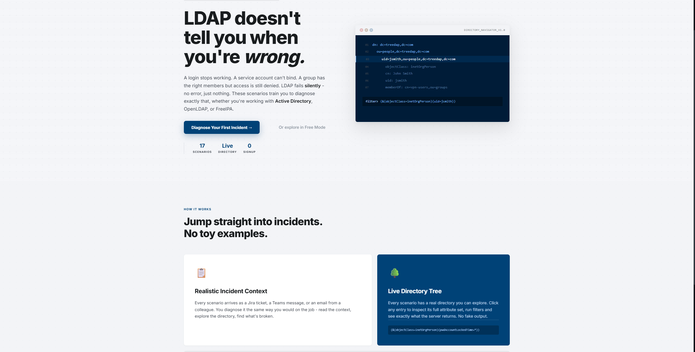
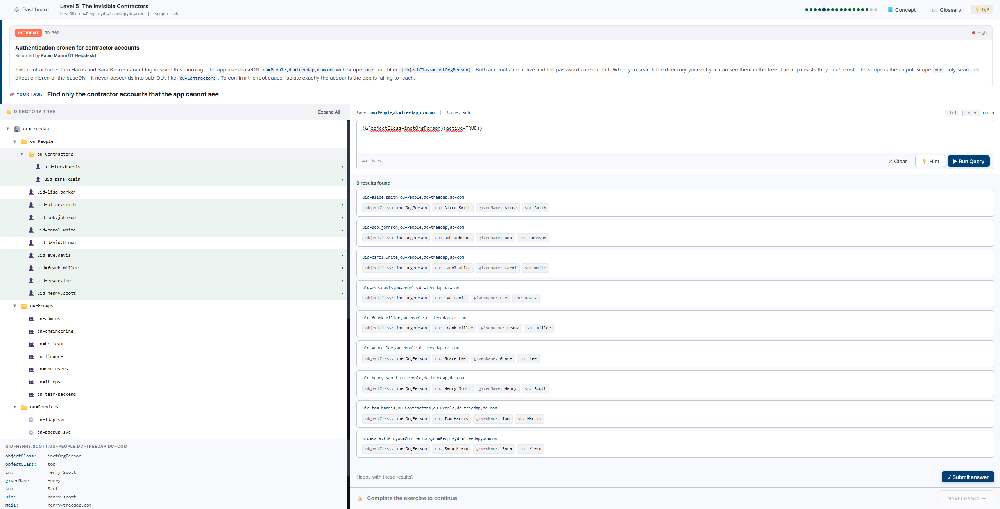
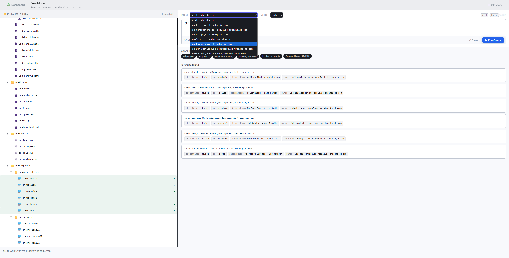

# TreeDap

An LDAP troubleshooting trainer that runs in your browser.
17 scenarios based on bugs I (and probably you) have hit in production: wrong baseDN, scope set to `one` when it should be `sub`, apps searching for `uid` in an AD-synced tree, bind DNs that no longer exist because someone moved the service account into a new OU, and so on.

Live at [treedap.com](https://treedap.com). No signup, no backend, everything runs client-side.



## Why

Most LDAP issues don't necessarily throw an error. Typically the bind just returns "invalid credentials", the query returns no entries, the application silently fails and logs `authentication failed`. There are so many totally different causes behind that one message and the only way I ever learned to tell them apart was by experiencing them live.

This project is the step by step guide I wished for. Each use case is a message, a incident ticket or an email from a colleague. You get the context, explore the directory, and create the filter that matches the diagnosis. Hints are available but cost a star.

## What's in it

**Three intro levels** covering the minimum vocabulary: entries, DNs, `objectClass`, baseDN + scope.

**Fourteen troubleshooting scenarios** across:

- filter-writing mistakes (wrong attribute, missing NOT, nested groups)
- scope and baseDN misconfigurations (the classic "worked on dev, empty on prod")
- migration pain points (OpenLDAP `uid` vs AD `sAMAccountName`, primary group IDs)
- password policy state you can't see from the app (`pwdAccountLockedTime`, `pwdChangedTime`, `shadowExpire`)
- security audits (anonymous bind exposure, credentials in cleartext)
- performance (why a `dc=root` subtree search with scope=sub is expensive)

**Free Mode** for when you just want to poke the directory without objectives. Same tree, same filter engine, no stars.





## Running locally

```bash
git clone https://github.com/saluc28/treedap.git
cd treedap
npm install
npm run dev
```

Open http://localhost:5173.

Build: `npm run build`. Preview build: `npm run preview`. Type check: `npx tsc --noEmit`.

No environment variables, no database, no dependencies outside the lockfile.

## Tech choices

React + TypeScript + Vite. React is aliased to `preact/compat` in `vite.config.ts` to cut the bundle size.

The LDAP engine is hand-written. `src/engine/ldapParser.ts` is an RFC 4515 parser (AND / OR / NOT, presence, equality with `*` wildcards, comparison operators). `src/engine/ldapEngine.ts` walks the in-memory directory applying baseDN + scope + filter. Both files are short enough to read in one sitting. No `ldapjs` or similar, partly because it's fun, mostly because a real LDAP client would have brought Node-only deps into the browser bundle.

Progress lives in `localStorage`. The only session state (current screen, current level) lives in `sessionStorage` so a page refresh doesn't kick you back to the landing.

Directory data is in `src/data/directory.ts`. Fake Corp, around 85 entries, intentionally includes AD-style attributes (`sAMAccountName`, `primaryGroupID`) alongside OpenLDAP style ones so the AD-specific scenarios are realistic.

## Adding a scenario

All scenarios are entries in `src/data/levels.ts`. Two shapes:

- **FilterLevel**: user writes a filter, the engine runs it, `validate()` compares the returned DN set against `expectedDNs`.
- **InvestigativeLevel**: user explores the tree and submits a number or Yes/No answer, `validateAnswer()` checks it.

For filter-writing scenarios, make sure the expected DN set is achievable with one well-formed filter against the provided baseDN + scope. The engine is strict about what the scope returns, so test by running the filter in Free Mode first.

Context copy lives in the same object. Keep it grounded in a ticket or a message from a colleague, not as abstract instruction. The whole point is that you read "all logins stopped at 03:12" and have to work backwards.

## Contributing

PRs welcome, useful areas:

- more scenarios, especially around ACL / ACIs, replication lag, referrals
- better AD coverage (`tokenGroups`, `userAccountControl` bit checks, though the engine would need extending)
- better mobile story (right now mobile just shows a "come back on a laptop" wall)
- accessibility (keyboard nav on the directory tree is rudimentary)

Open an issue first if it's a large change so we don't end up working against each other. Small fixes (typos, a single scenario) go straight to a PR.

## License

MIT. Do whatever you want with it.

## Credits

Built by [@saluc28](https://github.com/saluc28). The scenarios are composites of real things I've broken, fixed, or watched someone else fix over the years.